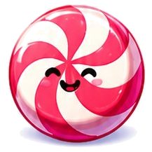

# CandyCore


PHP port of [charmbracelet/bubbletea](https://github.com/charmbracelet/bubbletea) —
the Elm-architecture TUI runtime at the heart of the Charmbracelet stack.

```php
use CandyCore\Core\{Cmd, KeyType, Model, Msg, Program};
use CandyCore\Core\Msg\{KeyMsg, WindowSizeMsg};

final class Counter implements Model
{
    public function __construct(public readonly int $count = 0) {}
    public function init(): ?\Closure { return null; }

    public function update(Msg $msg): array
    {
        if ($msg instanceof KeyMsg) {
            return match (true) {
                $msg->type === KeyType::Char && $msg->rune === 'q' => [$this, Cmd::quit()],
                $msg->type === KeyType::Up    => [new self($this->count + 1), null],
                $msg->type === KeyType::Down  => [new self($this->count - 1), null],
                default => [$this, null],
            };
        }
        return [$this, null];
    }

    public function view(): string { return "count: $this->count\n(↑/↓ to change, q to quit)"; }
}

(new Program(new Counter()))->run();
```

## Requirements

- PHP 8.1+
- `mbstring`, `intl` (for grapheme width)
- `pcntl` (signal handling — POSIX only)
- `react/event-loop` ^1.6 (Composer)

## Architecture

- **`Model`** — your app implements `init()`, `update(Msg)`, `view()`.
- **`Msg`** — marker interface for events. Built-ins: `KeyMsg`, `WindowSizeMsg`, `QuitMsg`.
- **`Cmd`** — `Closure(): ?Msg`. Async work whose result is dispatched as a Msg. Helpers in `Cmd::quit()`, `Cmd::batch()`, `Cmd::send()`.
- **`Program`** — orchestrator. Sets up TTY, runs the ReactPHP event loop, dispatches Msgs, drives renders at the configured framerate.
- **`InputReader`** — stateful byte-stream parser; handles split escape sequences across reads.
- **`Renderer`** — minimal cursor-home + erase + write. Diff-based renderer is a follow-up.
- **`Util/`** — `Ansi`, `Color`, `ColorProfile`, `Width`, `Tty` foundation utilities, shared with CandySprinkles.

## Demos

### Counter Model


### Timer


## Status

- **Phase 0** (foundation utilities): 🟢 complete.
- **Phase 3** (runtime): 🟡 ~40% — primitives + Program loop landed. Mouse, focus/blur, bracketed paste, function keys, and the diff renderer are upcoming.

See [../CONVERSION.md](../CONVERSION.md) for the full roadmap.

## Test

```sh
cd candy-core && composer install && vendor/bin/phpunit
```
